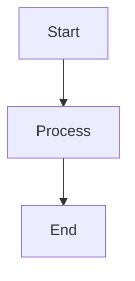

# Diagramming in Dunaev

## Overview

This project supports two diagramming tools for creating architecture diagrams, flowcharts, and visual documentation:

1. **Mermaid.js** — text-based diagrams, great for embedding in Markdown/docs
2. **Excalidraw** — hand-drawn style diagrams, saved as JSON files

Both tools produce files that can be viewed in any browser without special software.

---

## 1. Mermaid.js

### What is it?

Mermaid.js lets you define diagrams as plain text using a simple syntax. Diagrams can be embedded directly into Markdown files (GitHub, GitLab, etc. render them natively) or rendered to SVG/PNG.

### Diagram files

| File | Description |
|------|-------------|
| `architecture.mmd` | System architecture — all layers from User to Tools |
| `modules.mmd` | Module interaction — how Website, DevOps, Design, etc. relate |
| `ci-pipeline.mmd` | CI/CD pipeline — build → quality → deploy flow |

### How to render

```bash
cd /home/i/Проекты/dunaev-diagrams
npx mmdc -i diagram.mmd -o diagram.svg
```

### How to write

Mermaid uses simple text syntax. Example:



Full syntax reference: https://mermaid.js.org/syntax/

### Viewing

- **GitHub** — `.mmd` files render automatically in the repo
- **Any browser** — SVG outputs can be opened directly
- **VS Code** — install the "Mermaid Preview" extension for live editing

---

## 2. Excalidraw

### What is it?

Excalidraw produces hand-drawn-style diagrams with boxes, arrows, text, and freeform elements. It's ideal for architecture sketches and concept diagrams.

### Diagram files

| File | Description |
|------|-------------|
| `architecture.excalidraw` | Full system architecture of Dunaev |

### How to view

1. Go to https://excalidraw.com
2. Click **Open** (folder icon, top-left)
3. Select the `.excalidraw` file
4. Edit, export as PNG/SVG, or share via link

### How to create

The Hermes Excalidraw skill can generate `.excalidraw` JSON files programmatically:

```bash
# Load the excalidraw skill in Hermes
# Write elements as JSON array
# Save as .excalidraw file
```

Excalidraw JSON structure:
```json
{
  "type": "excalidraw",
  "version": 2,
  "elements": [...],
  "appState": {
    "viewBackgroundColor": "#f8f9fa"
  }
}
```

### Element reference

See `~/.hermes/skills/creative/excalidraw/SKILL.md` for full element reference.

---

## Choosing a tool

| Use Case | Tool | Why |
|----------|------|-----|
| Architecture diagrams | Excalidraw | Hand-drawn look, flexible layout |
| Workflow / pipeline | Mermaid | Auto-layout, embeddable in Markdown |
| Module relationships | Mermaid | Directed graphs, auto-layout |
| Free-form design sketch | Excalidraw | Total creative control |
| In-document diagrams | Mermaid | Render inline in Markdown |
| Export to SVG/PNG | Both | Both support export |

---

## Workflow

1. **Create** the diagram as `.mmd` or `.excalidraw` in `dunaev-diagrams/`
2. **Render** Mermaid to SVG: `npx mmdc -i file.mmd -o file.svg`
3. **Copy** SVG outputs to the project docs
4. **Embed** in Markdown with ``
5. **Version control** both source files and rendered SVGs
