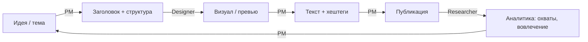
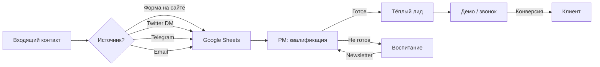

# Маркетинг M5: Контент-план, SMM, SEO, CRM

**Дата:** 2026-06-06
**Автор:** PM (ecdaa85f)
**Проект:** Architect
**Статус:** ✅ Утверждено
**Родитель:** DUN-96

---

## 1. Контент-стратегия (1–3 месяца)

### Цель
Запустить Architect как open-source проект с активным сообществом. 
Первые 100 GitHub звёзд и 10 активных установок за 3 месяца.

### Тональность
- Техническая, но доступная
- #buildinpublic — честно показываем процесс
- Русский + английский контент (60/40)

### Контент-воронка

```
Осведомлённость ──→ Интерес ──→ Рассмотрение ──→ Конверсия
    (блог,     )    (гайды,   )    (кейсы,    )    (призыв,  )
    (соцсети   )    (сравнения)    (воркшопы  )    (демо     )
```

### Месяц 1 — Launch (недели 1–4)

| Неделя | Тема | Формат | Канал |
|--------|------|--------|-------|
| W1 | "Собираем open-source экосистему для веб-присутствия" | Статья / Thread | Dev.to, Twitter |
| W1 | Превью лендинга Architect | Пост + картинка | Twitter, Telegram |
| W2 | "Почему я собрал свой стек вместо Vercel" | Кейс-статья | Habr, Dev.to |
| W2 | Разбор архитектуры: Astro.js + Cloudflare + ComfyUI | Технический пост | Twitter, Telegram |
| W3 | "Как мы генерируем превью через Stable Diffusion" | Гайд + демо | Habr, YouTube |
| W3 | Сравнение: Architect vs Netlify vs Vercel vs self-hosted | Таблица-пост | Twitter, Dev.to |
| W4 | "MVP готов: что внутри первого релиза" | Релиз-пост | Все каналы |
| W4 | Product Hunt launch | Лаунч-пост | Product Hunt |

### Месяц 2 — Growth (недели 5–8)

| Неделя | Тема | Формат | Канал |
|--------|------|--------|-------|
| W5 | "Контент-маркетинг для инди-разработчика: полный гайд" | Статья | Habr, Dev.to |
| W5 | Разбор: как настроить CI/CD для Astro.js за 10 минут | Видео-гайд | YouTube, Twitter |
| W6 | "Open Source ≠ бесплатно: как мы держим $0 инфраструктуру" | Кейс | Habr |
| W6 | Интервью / Q&A с командой Architect | Telegram AMA | Telegram |
| W7 | "SEO для сайта на Astro.js: чеклист" | Гайд + чеклист | Dev.to, Blog |
| W7 | A/B тест двух лендингов — разбор результатов | Кейс | Twitter, Telegram |
| W8 | "Месяц после запуска: метрики, выводы, планы" | Ретро-пост | Все каналы |

### Месяц 3 — Scale (недели 9–12)

| Неделя | Тема | Формат | Канал |
|--------|------|--------|-------|
| W9 | "Автоматизация маркетинга для соло-фаундера" | Гайд | Habr, Dev.to |
| W9 | Видео-демо: полный цикл создания сайта в Architect | Видео 5 мин | YouTube |
| W10 | Гостевой пост / коллаборация с indie-проектом | Коллаб | Перекрёстный |
| W10 | "От 0 до 100 звёзд на GitHub: наш путь" | Итоговый кейс | Все каналы |
| W11 | "Сравнение SSG в 2026: Astro, Hugo, Next.js, Eleventy" | Исследование | Dev.to |
| W11 | Митап / онлайн-воркшоп "Собери сайт за 30 минут" | Live | Twitch, Zoom |
| W12 | Квартальный отчёт: что построили, чему научились | Ретро | Все каналы |

### Типы контента

| Тип | Частота | Цель |
|-----|---------|------|
| Twitter/X thread | 2–3/нед | Осведомлённость, #buildinpublic |
| Telegram пост | 1–2/нед | Русскоязычное dev-сообщество |
| Блог-статья (Habr/Dev.to) | 1/нед | Глубокий контент, SEO |
| YouTube видео | 1/2 нед | Визуальная демонстрация |
| Release notes | По релизам | Прозрачность, доверие |

---

## 2. SMM-пайплайн

### Pipeline: Идея → Контент → Публикация



### Пул идей (backlog контента)

| # | Идея | Статус | Ответственный |
|---|------|--------|-------------|
| 1 | "Как мы держим infra $0" | 🆕 Идея | PM |
| 2 | Архитектура: C4 диаграмма живьём | 🆕 Идея | Designer |
| 3 | Разбор: Astro.js Islands Architecture | 🆕 Идея | Lead Engineer |
| 4 | "Stable Diffusion для превью: наш workflow" | 🆕 Идея | Designer |
| 5 | "Paperclip + Hermes: оркестрация AI-агентов" | 🆕 Идея | PM / CEO |
| 6 | Журнал ошибок: что пошло не так при запуске | 🆕 Идея | PM |

### Каналы и настройки

| Канал | Формат | Тональность | Частота |
|-------|--------|-------------|---------|
| **Twitter/X** | Threads, скриншоты, демо | EN, коротко, технично | 2–3/нед |
| **Telegram** | Посты, ссылки, обсуждения | RU, развёрнуто, сообщество | 1–2/нед |
| **YouTube** | Гайды, демо, ретро | RU/EN, 5–15 мин | 1/2 нед |
| **Habr** | Кейсы, гайды, сравнения | RU, 10+ мин чтения | 1/2 нед |
| **Dev.to** | Кейсы, гайды | EN, 5+ мин чтения | 1/нед |

### Хештеги

**Английские:** #buildinpublic #indiemaker #opensource #astrojs #jamstack #webdev

**Русские:** #индиразработка #opensource #astrojs #вебразработка #jamstack

---

## 3. SEO-аудит и план оптимизации

### Текущий статус
- Сайт: лендинг на Astro.js (локально)
- Домен: dunaev.dev (не настроен)
- CI/CD: в процессе
- Open Graph: требует внедрения

### Ключевые страницы и их оптимизация

| Страница | Целевые ключи | Тип | План |
|----------|--------------|-----|------|
| `/` (Landing) | "architect platform", "open source website builder" | Коммерческая | Оптимизировать мета, H1, CTA |
| `/blog` | "static site generator tips", "jamstack tutorial" | Блог | Технические SEO-статьи |
| `/docs` | "astro js setup", "cloudflare pages guide" | Документация | Long-tail ключи |
| `/pricing` | (скрыть до запуска монетизации) | — | — |

### SEO-чеклист (до запуска)

- [ ] Мета-теги: title, description, OG на каждой странице
- [ ] Sitemap.xml (авто-generate через Astro)
- [ ] Robots.txt
- [ ] Open Graph изображения (1200×630, шаблон готов в brand-kit)
- [ ] Canonical URLs
- [ ] Structured Data (JSON-LD: Organization, Article, BreadcrumbList)
- [ ] RSS Feed для блога
- [ ] Performance: Lighthouse 90+
- [ ] Mobile-first: адаптив
- [ ] Core Web Vitals: LCP < 2.5s, FID < 100ms, CLS < 0.1

### SEO-план (после запуска)

| Месяц | Действие | Метрика |
|-------|----------|---------|
| M1 | Базовый SEO-аудит, исправление ошибок | Coverage в GSC |
| M1 | Публикация 2 SEO-оптимизированных статей | Индексация за 7 дней |
| M2 | Внутренняя перелинковка статей | Page Authority |
| M2 | Внешние ссылки (гостевые посты, GitHub) | Referring Domains |
| M3 | Анализ конкурентов по ключам, обновление контента | Рост трафика |

### SEO-инструменты

| Инструмент | Цель | Статус |
|-----------|------|--------|
| Google Search Console | Индексация, ошибки | ❗ Настроить после деплоя |
| Яндекс.Вебмастер | Индексация в Яндексе | ❗ Настроить после деплоя |
| Lighthouse CI | Performance бюджет | 🔄 В CI/CD |
| Ahrefs / Ubersuggest | Ключевые слова | 🔄 Выбор |

---

## 4. Базовая CRM для контактов/лидов

### MVP CRM (Google Sheets + API)

До внедрения полноценной CRM используем минимальный стек:

```yaml
Хранилище: Google Sheets (через gws CLI)
Структура таблицы: "Лиды Архитектор"
  - ID (авто)
  - Дата
  - Источник (Twitter / Telegram / Habr / Email / Сайт)
  - Имя / Контакт
  - Статус (новый / тёплый / клиент / закрыт)
  - Комментарий
  - Следующее действие
  - Ответственный
```

### Пайплайн лидов



### План развития CRM

| Этап | Что | Когда |
|------|-----|-------|
| **P0** | Google Sheets таблица | Немедленно |
| **P1** | Форма захвата на сайте (Email) | MVP |
| **P2** | Автоматическое добавление из соцсетей | Месяц 2 |
| **P3** | Telegram-бот для лидов | Месяц 3 |
| **P4** | Полноценная CRM (20+ лидов) | При масштабе |

### Интеграция с маркетингом

При каждом действии PM:
1. Публикация контента → замерить лиды из этого канала
2. Недельный отчёт: сколько лидов, откуда, конверсия
3. Корректировка контент-плана на основе данных

---

## 5. KPI и метрики

| Метрика | Цель M1 | Цель M2 | Цель M3 |
|---------|---------|---------|---------|
| GitHub stars | 30 | 70 | 100 |
| Telegram подписчики | 50 | 150 | 300 |
| Twitter followers | 100 | 250 | 500 |
| Сайт: уникальные посетители/мес | 200 | 500 | 1000 |
| Лиды (email) | 10 | 30 | 50 |
| Активные установки | 3 | 7 | 15 |

---

## 6. Связанные документы

- [MARKET_ANALYSIS.md](../MARKET_ANALYSIS.md) — анализ рынка от Researcher
- [ARCHITECTURE.md](../ARCHITECTURE.md) — общая архитектура проекта
- [BRAND-KIT.md](../brand-kit/BRAND-KIT.md) — бренд-кит от Designer
- [LANDING README.md](../landing/README.md) — статус лендинга
- [PM-v1: Sprint Management](../../../Onboarding/_default/SCHEMAS/process/PM-v1-sprint-management.md) — процессы PM
