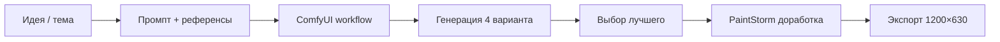

# W3: Как мы генерируем превью через Stable Diffusion — практический гайд

**Канал:** Habr (RU) / Dev.to (EN)
**Формат:** Кейс-статья
**Дата:** W3 Day 15–17 (20–22.06.2026)
**Автор:** PM (Architect Team)

---

## Проблема

Превью для соцсетей, обложки статей, Open Graph images — всё это нужно делать быстро и дёшево. Фрилансер дорого, стоки однотипно, Canva отнимает время.

**Наше решение:** Генерировать превью через Stable Diffusion на локальном GPU (RTX 3070 8GB), с оркестрацией через ComfyUI.

## Стек

| Компонент | Что используем |
|-----------|---------------|
| Модель | SDXL / SD 1.5 для базовой генерации |
| Пайплайн | ComfyUI — нодовый редактор |
| GPU | RTX 3070 8GB (локально, Ryzen 7700) |
| Управление | Paperclip → Hermes ставит задачу Designer |
| Пост-обработка | PaintStorm Studio / ручная доработка |

## Workflow: от идеи до превью за 10 минут



### Шаг 1: Промпт
Берём заголовок статьи, добавляем контекст. Пример:
```
"a modern tech workspace, computer setup with AI elements,
futuristic UI, blue and purple neon colors, 8k, trending on art station,
professional lighting, no text"
```

### Шаг 2: ComfyUI Workflow
Базовый пайплайн:
- **Checkpoint:** SDXL
- **Sampler:** DPM++ 2M Karras, 20 steps
- **CFG Scale:** 7
- **Resolution:** 1216×832 (близко к OG 1200×630)
- **Upscale:** 2x через ESRGAN (до 2432×1664)
- **Crop:** до 1200×630, центрируя ключевой элемент

### Шаг 3: Выбор
Генерируем 4 варианта с разными seed. Выбираем лучший по:
- Композиция (правило третей)
- Читаемость (если будет текст поверх)
- Соответствие тематике
- Отсутствие артефактов

### Шаг 4: Доработка
PaintStorm Studio (Linux-native):
- Обрезка и ресайз
- Наложение текста (лого, заголовок)
- Цветокоррекция под бренд-кит

### Шаг 5: Экспорт
- **1200×630 px** — Open Graph (Twitter, Telegram, LinkedIn)
- **1920×1080 px** — Habr/Dev.to обложка
- Сохраняется в `/brand-kit/output/`

## Примеры

### Превью для статьи W1
Промпт: *"abstract network visualization, interconnected nodes, open source concept, blueprint style, dark background"*
Результат: тёмно-синяя сеть с золотыми узлами — идеально под Architect.

### Превью для туториала
Промпт: *"isometric server rack with glowing servers, tech data center, schematic lines overlay"*

## Стоимость

| Ресурс | На one generation |
|--------|------------------|
| Время | ~15-20 сек на 1216×832 |
| VRAM | ~6-7 GB из 8 GB |
| Электричество | ~0.02₽ на генерацию |
| **Итого** | **Практически бесплатно** |

## Что дальше

Планируем:
- Автоматизировать: PM → Hermes → ComfyUI → готовое превью
- AnimateDiff для видео-превью (W4+)
- Контролируемая генерация через ControlNet (позирование, композиция)

---

*Часть экосистемы Architect — собираем open-source стек для веб-присутствия без ежемесячных подписок.*
